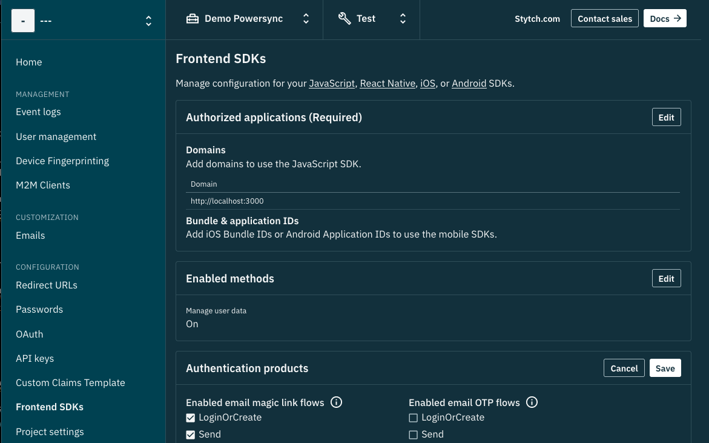
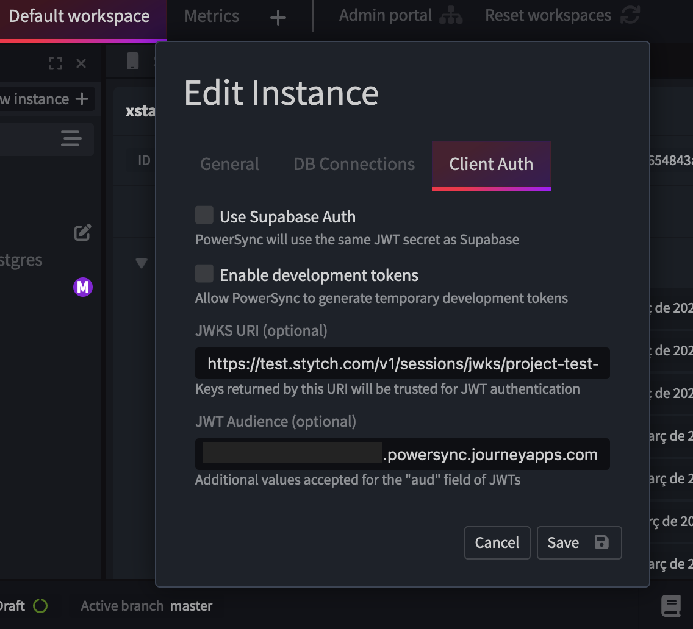
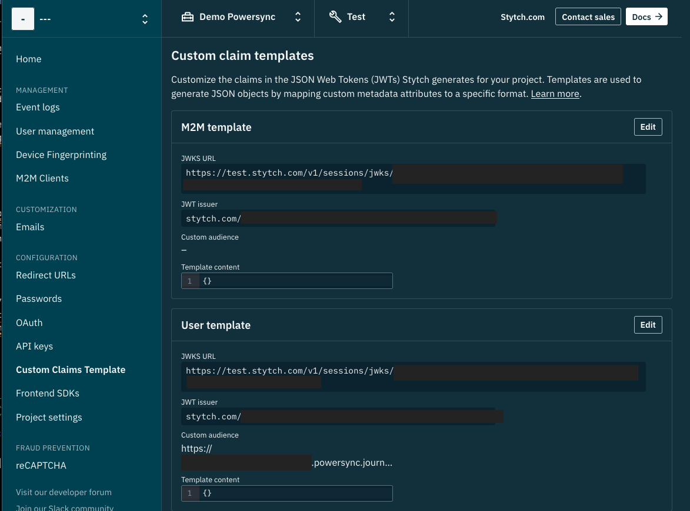
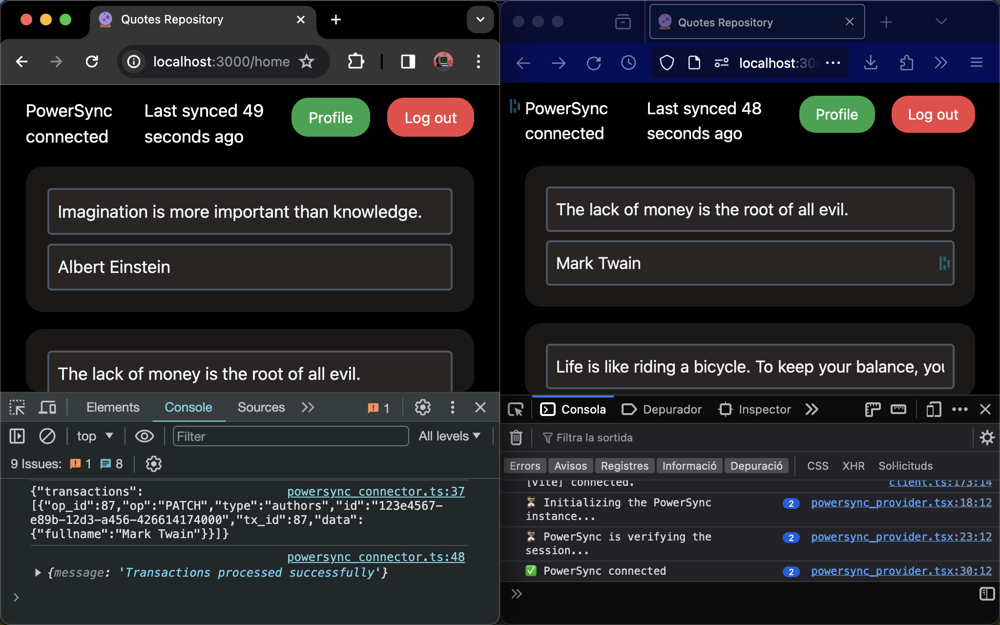

# React Local-First Web Application with PowerSync and Cloud Database Sync


This guide walks you through setting up a React application designed with a local-first database philosophy, enabling seamless offline functionality and synchronization with cloud databases. By leveraging PowerSync for local data management and integrating cloud database synchronization, this setup is also extendable to React Native applications. Whether you're new to React or looking to implement offline capabilities in your projects, this guide provides a step-by-step approach to get you started.

## Prerequisites

- Install Yarn on your computer from [yarnpkg.com](https://yarnpkg.com/).

## Steps

### Install Dependencies

- Execute `pnpm i` to install the necessary dependencies.

### Prepare Environment Variables

- Duplicate the `.example.env` file and rename it to `.env`.

### Create a Postgres Database

- For database services, I use [Neon](https://neon.tech/). However, any Postgres provider is suitable.
- Create a Neon account, set up a database with a username and password, and save these credentials in the `.env` file.

> IMPORTANT: A localhost database cannot be used since PowerSync services require internet access to connect to your database.

### Create an Authentication Account

PowerSync requires JWKS tokens for authentication. Visit [PowerSync Authentication](https://docs.powersync.com/architecture/powersync-service#authentication) for more details.

We use [Stytch](https://stytch.com/) for authentication due to its compatibility with React and React Native, and its cost-effectiveness.

Steps for setting up Stytch:

- Register an account and create a project on Stytch.
- Copy the project's `public token` from [Stytch's API Keys](https://stytch.com/dashboard/api-keys?env=test) and paste it into `.env`.
- Add your localhost domain `http://localhost:3000` to your Stytch project [SDK Configuration](https://stytch.com/dashboard/sdk-configuration?env=test).
- Ensure the email link is enabled under the `Authentication products` section.
- Set the redirection URI to `http://localhost:3000/authenticate` in [Stytch's Redirect URLs](https://stytch.com/dashboard/redirect-urls?env=test) for login redirection.
- To set up email link authentication (magic link), refer to [Stytch's Magic Links Guide](https://stytch.com/docs/guides/magic-links/email-magic-links/api).

_A screenshot of domain and email link settings on Stytch_


### Configure PowerSync and Authentication Tokens

To integrate PowerSync with your React application and set up authentication tokens, follow these comprehensive steps:

1. Create a PowerSync account:
   - Navigate to [PowerSync's signup page](https://powersync.journeyapps.com) and create a new account.
2. Set up database connection:
   - Once your account is active, create a new database instance. This instance should have the same name as your Neon database to ensure consistency.
   - PowerSync needs to connect to your Postgres database. For setting up a connection to Neon, follow the guide provided by PowerSync specific to Neon at [PowerSync Database Setup for Neon](https://docs.powersync.com/usage/installation/database-setup/neon).
     - Remember, Neon uses the default port `5432`.
     - Certificates are not required for Neon; leave this field blank.
     - The URI format for Neon is typically: `postgresql://<neon_username>@<neon_host_name>:5432/<neon_database_name>`.

3. Configure authentication service (Stytch) with PowerSync:
   - In your PowerSync account, navigate to the database instance you created and select the `Client auth` tab.
   - You will integrate Stytch's authentication service here. This involves using Stytch's JSON Web Key Set (JWKS) URI and JWT settings.
     - Disable options like `Use Supabase Auth` and `Enable development tokens` if they are not relevant to your setup.
     - Find Stytch's JWKS URI in your Stytch dashboard under [Custom Claim Templates](https://stytch.com/dashboard/custom-claim-templates?env=test). This URI will be used in PowerSync's authentication configuration.
     - The JWT Audience and custom audience field in Stytch should match your PowerSync instance URL. This ensures that tokens are correctly validated against your application.

4. Copy the project instance URL from PowerSync, found in the `General` tab of your database instance setup. This URL should be entered into the corresponding variable in your `.env` file, linking your application directly to the PowerSync service.




### SQL Files for Database Configuration

Setting up your Postgres database correctly is crucial for the successful operation of your application. This involves creating SQL migration files that will structure your database, set up necessary roles, and optionally prefill it with data. Here's how to go about it:

1. Create migration files:
   - You will need to create SQL files that define the structure of your database, including tables, relationships, and any initial data you wish to insert. These are known as migration files. You can copy the ones in `backend/migrations` folder.
2. Naming convention:
   - Follow a consistent naming convention for your migration files to maintain order and clarity. A common practice is to prefix filenames with sequential numbers (e.g., `01__create_tables.sql`, `02__setup_powersync_user.sql`) to indicate the order of execution. For more on naming conventions, see [Red Gate's Migrations Documentation](https://documentation.red-gate.com/fd/migrations-184127470.html).
3. Contents of migration files:
   - **Tables:** The first migration file should define all the tables and their fields required by your application.
   - **PowerSync user:** To integrate with PowerSync, you may need to create a specific user role in your database that PowerSync can use to perform operations. Depending on your database provider, this step may vary. For Neon users, it's recommended to create this user through the Neon dashboard's "Roles" feature, following the guide provided at [PowerSync Database Setup for Neon](https://docs.powersync.com/usage/installation/database-setup/neon).
   - **(Optional) Prefill data:** If your application benefits from having preloaded data (e.g., demo accounts, initial settings), you can include this in a separate migration file. This step is optional but can be useful for testing and demonstration purposes.

4. Storing migration files:
   - Place all your migration files in a dedicated directory within your project, such as `backend/migrations`, to keep them organized and easily accessible for deployment.

### Upload the Files to Your Postgres Database

To apply your SQL migration files to your Postgres database, you can use one of two methods provided in this project: a custom script or the Flyway command-line tool. These methods facilitate the migration process, setting up your database structure for the application.

#### [WIP] Using a Script

1. Run the custom script
   - This project includes a script to automate the migration process. To execute this script, simply run the following command in your terminal:

     ```sh
     pnpm -F migration migrate-effect
     ```

   - This command will locate the SQL migration files in your `migration` app and apply them to your Postgres database, adhering to the order specified by the file names.

#### Using Flyway

Flyway is an industry-standard tool for managing database migrations with more extensive functionality. If you prefer using Flyway for applying your SQL files:

1. Installation:
   - Ensure Flyway is installed on your machine. If you haven't installed it yet, refer to the official [Flyway documentation](https://flywaydb.org/documentation/usage/commandline/#download-and-installation) for installation instructions.

2. Configuration:
   - A Flyway configuration file (`flyway.toml` or similar) should already be part of your project setup. This file contains all necessary configurations for connecting Flyway to your Postgres database.

3. Run migrations:
   - To apply the migrations using Flyway, run the following command:

     ```sh
     flyway -configFiles="/<computer_path_to_repo>/backend/flyway.toml" migrate
     ```

   - Replace `"/path/to/your/backend/flyway.toml"` with the actual path to your Flyway configuration file. This command instructs Flyway to apply the SQL migration files found in the locations specified within your configuration file.

### Deploy PowerSync Synchronization Rules

Deploy your database synchronization rules to PowerSync by copying the `database/sync_rules.yaml` file to your PowerSync project as outlined in [PowerSync Sync Rules Documentation](https://docs.powersync.com/usage/sync-rules).

### [WIP] Running the Server and Web Application

- Start the Express server handling SQL modifications via PowerSync with `pnpm -F server run start-effect`.
- Launch the React application with `pnpm -F web run start`.
- Open `http://localhost:3000` in two browser tabs to test real-time data synchronization across instances.
- Open browsers' console to see the logs. You should enable all types of logs because the React web uses `console.debug`.



## Extra

Debugging in Chrome with VSCode:

1. Launch both web and server.
2. Start Chrome with remote debugging on port `9222`, following the [VSCode Chrome Debug Extension Guide](https://github.com/Microsoft/vscode-chrome-debug?tab=readme-ov-file#attach).
3. Access the web server on Chrome and attach the VSCode debugger.

## Resources

- EffectJS
  - Guides
  - Introduction <https://github.com/antoine-coulon/effect-introduction>
  - Schema <https://github.com/Effect-TS/effect/blob/main/packages/schema/README.md>
  - Server
  <https://github.com/Effect-TS/effect/blob/main/packages/rpc-http/examples/router.ts>
  - Server with open telemetry <https://github.com/IMax153/advanced-effect-workshop/blob/main/workshop/solutions/session-04/exercise-02.ts>
    - Complete projects
      - <https://github.com/effect-app/sample/>
      - <https://github.com/ccntrq/git-jira-branch/blob/master/src/types.ts>
      - <https://github.com/TylorS/typed/blob/development/examples/todomvc>
      - Incl. auth, migrations <https://github.com/datner/effect-remix>
- [Kysely](https://kysely.dev/docs/), a query builder for fetching SQL data, alongside PowerSync. API documentation and examples are available at [Kysely API Docs](https://kysely-org.github.io/kysely-apidoc) and [Kysely GitHub](https://github.com/kysely-org/kysely/blob/master/example), respectively.
